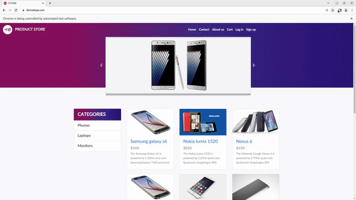

<!-- PROJECT HEADER -->
<p align="center">
  <!--PROJECT TITLE AND DESCRIPTION -->
 <h1 align="center">Automation of Product Store Web Application Using Selenium and TestNG</h1>

  <p align="center">
    A web automation project to automate testing process Online Store built using Selenium & TestNG in Java.
    <br /><br/>
    <a href="https://www.linkedin.com/in/lavatech-technology-81aa6a14b/">
        </a>
    <a href="">
        </a>

  </p>
</p>
<hr>

<!-- ABOUT THE PROJECT -->

## About The Project
The objective of this project is to automate key functionalities of a product store web application using Selenium WebDriver integrated with TestNG for test management. The project covers automating user signup, login, adding products to the cart, and placing an order. TestNG is used for organizing and running test cases efficiently, generating detailed reports, and handling assertions for validating each functionality.


### Built With
* [Java 8](https://www.oracle.com/java/technologies/javase/javase-jdk8-downloads.html) as programming language
* [Maven](https://maven.apache.org/) for Package Management and Build Automation
* [Selenium](https://www.selenium.dev/) for Web Automation
* [TestNG](https://testng.org/) for Java testing framework that supports annotations, parallel execution, and detailed reporting for efficient test automation.

<!-- GETTING STARTED -->
## Getting Started

### Prerequisites
  Basic understanding of Java with Maven, Selenium and TestNG.

### Running the project
Steps are listed below to get this project up and running in your development environment.

* Setup Java with JDK 1.8. For reference: Use this official [Tutorial](https://docs.oracle.com/javase/10/install/installation-jdk-and-jre-microsoft-windows-platforms.htm)

* Setup Maven. Follow this link: [Maven Setup](https://maven.apache.org/install.html)

* Clone this repository in your target folder.
```
git clone https://github.com/bishwa-poudel/selenium-web-automation-example.git
```

* Finally run maven build command:

```
mvn clean install
```


* Once you see this message in the console, your build is ready. Goto `target/lis-intranet-automation.war}` to get the archived file.

_Note: I have used WAR for packaging. If you want to build into the jar file, change the `<packaging>` inside pom.xml file to jar._

```
 <packaging>jar</packaging>
```

Now you can use any application server to deploy the archived java file. For this project I am using [Wildfly v22.0.1](https://www.wildfly.org/) 

Congrats !!! You are now able to run the project in your own development environment.

## Usage



### For Manual Check in
```http
GET /lis-intranet-automation/api/action/checkin
```

### For Manual Checkout
```http
GET /lis-intranet-automation/api/action/checkout
```

## Authors

* **Lavatech Technology** - *Initial work* - [Yogita Soni](https://github.com/lavatech321)

## Contact
[![LinkedIn][linkedin-shield]][linkedin-url] [![Twitter][twitter-shield]][twitter-url]

<!-- MARKDOWN LINKS & IMAGES -->
<!-- https://www.markdownguide.org/basic-syntax/#reference-style-links -->

[linkedin-shield]: https://img.shields.io/badge/-LinkedIn-black.svg?style=for-the-badge&logo=linkedin&colorB=555
[linkedin-url]: https://www.linkedin.com/in/lavatech-technology-81aa6a14b/